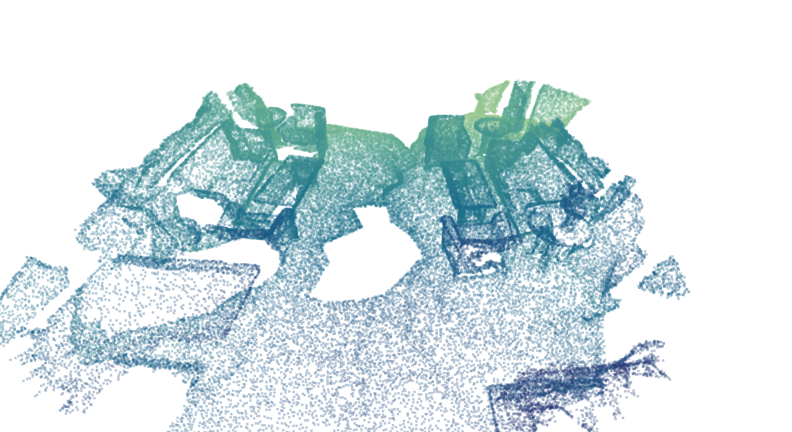
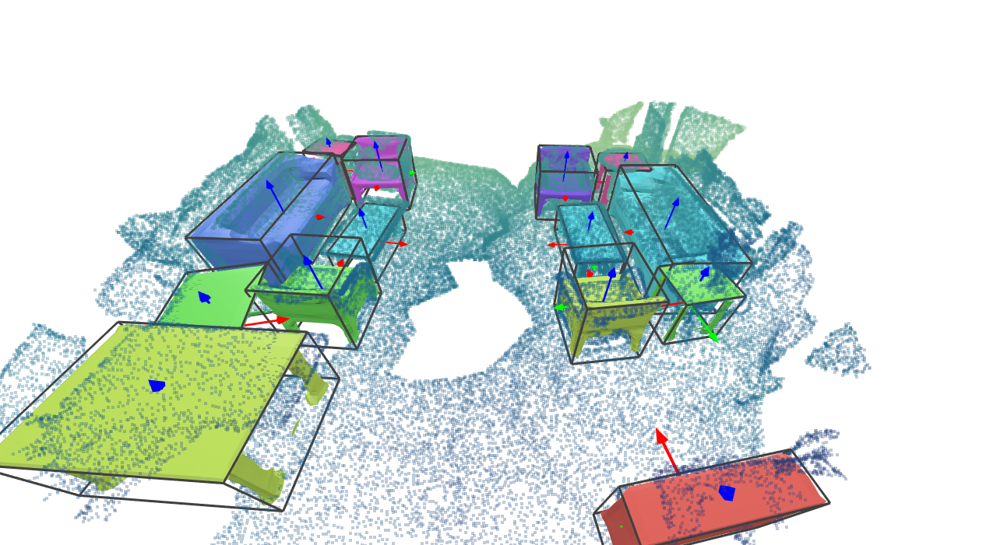
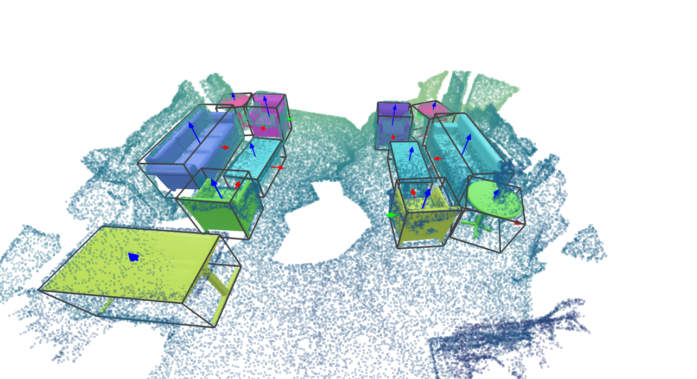

# Weakly-supervised-3D-semantic-scene-reconstruction
**A project within the Advanced Deep Learning course at Technical University Munich** <br>
Alexander Baumann, Sophia Wagner


 

From an incomplete point cloud of a 3D scene (left), our method learns to reconstruct instance meshes as the output (right) in a weakly-supervised fashion. <br>
Our main contributions are: 
* We provide a novel approach for semantic instance reconstruction on a real-world point cloud scan without using any supervision on this dataset.
* We propose a shape prior which can predict the signed distance field directly from a given input point cloud, without voxelizing the scene.

In the following, we cite [RfD-Net](https://github.com/yinyunie/RfDNet). 

---

### Install
1. This implementation uses Python 3.6, [Pytorch1.7.1](http://pytorch.org/), cudatoolkit 11.0. We recommend to use [conda](https://docs.conda.io/en/latest/miniconda.html) to deploy the environment.
   * Install with conda:
    ```
    conda env create -f environment.yml
    conda activate rfdnet
    ```
    * Install with pip:
    ```
    pip install -r requirements.txt
    ```
   
2. Next, compile the external libraries by
    ```
    python setup.py build_ext --inplace
    ```
3. Install [PointNet++](https://github.com/erikwijmans/Pointnet2_PyTorch) by
    ```
   export CUDA_HOME=/usr/local/cuda-X.X  # replace cuda-X.X with your cuda version.
   cd external/pointnet2_ops_lib
   pip install .
    ```

---

### Prepare Data
In our paper, we use the input point cloud from the [ScanNet](http://www.scan-net.org/) dataset and the [ShapeNet](https://shapenet.org/) dataset for training the shape prior. 
For evaluating IoU scores with ground truth labels, we use the [Scan2CAD](https://github.com/skanti/Scan2CAD) dataset which aligns the object CAD models from [ShapeNetCore.v2](https://shapenet.org/) to each object in ScanNet. 
As we trained our model in a weakly-supervised fashion, we don't need the [Scan2CAD](https://github.com/skanti/Scan2CAD) data. 
Instead, one can use the chamfer distances for evaluation. 


##### Preprocess ScanNet data
You can download the processed samples [[link](https://livebournemouthac-my.sharepoint.com/:u:/g/personal/ynie_bournemouth_ac_uk/EZjNNhRxcnBGlGo18ASb-xUBDP1gxkRGI5uO1foLl8v8Kg?e=yVXbfN )] to the directory below. 
For the preparation of the data, we refer to [RfD-Net](https://github.com/yinyunie/RfDNet). 
```
datasets/scannet/processed_data/
```


##### Prepare ShapeNet data
You can directly download the processed data [[link](https://livebournemouthac-my.sharepoint.com/:f:/g/personal/ynie_bournemouth_ac_uk/EtFYCJNn1IdInSg2_QbVU1UB6BYW1sGI5y4D5u8eeaZffQ?e=CHqAyG )] and extract them to `datasets/ShapeNetv2_data/` as below. 
For the preparation of the data, we again refer to [RfD-Net](https://github.com/yinyunie/RfDNet). 
For training and testing our model the file 'watertight_scaled_simplified.tar.gz' is sufficient. 
```
datasets/ShapeNetv2_data/watertight_scaled_simplified
```
For computing IoU scores, you also need to download the files 'point.tar.gz' and 'voxel.tar.gz' and put them into the following directories. 
```
datasets/ShapeNetv2_data/point
datasets/ShapeNetv2_data/voxel
```

In order to store point clouds of the ShapeNet and corresponding query points for training the shape prior, you will have to run the following script: 
```
python data_preparation/prepare_data.py
```


   

##### Verify preprocessed data
   After preprocessed the data, you can run the visualization script below to check if they are generated correctly.
   
   * Visualize ScanNet+Scan2CAD+ShapeNet samples by
     
      ```
      python utils/scannet/visualization/vis_gt.py
      ```
     
      A VTK window will be popped up like below.
   
      

---
### Training, Generating and Evaluation
We use the configuration file (see 'configs/config_files/****.yaml') to fully control the training/testing/generating process.
You can check a template at `configs/config_files/ISCNet.yaml`.

#### Training
We firstly pretrain our **detection** module. You can follow the process below.

1. Pretrain the **detection** module by
   
   ```
   python main.py --config configs/config_files/ISCNet_detection.yaml --mode train
   ```
   It will save the detection module weight at
   `out/detection/a_folder_with_detection_module/model_best.pth`

2. Copy the weight path of detection module (see 1.) into `configs/config_files/ISCNet_retrieval.yaml` as
   ```
   weight: ['out/detection/a_folder_with_detection_module/model_best.pth']
   ```
   
3. Next, we train the **shape prior** by running 
   ```
   python train_prior.py 
   ```
   The configurations can be set in `configs/config_files/ISCNet_detection.yaml`
   
4. Copy the weight path of the shape prior into `configs/config_files/ISCNet_retrieval.yaml` as
   ```
   weight_prior: 'out/prior/a_folder_with_prior_module/weights_epoch_last.pth'
   ```
   The shape embeddings will be saved at `out/prior/shape_embeddings.pt`

5. Now, we have to train the **shape retrieval** by running 
    ```
   python main.py --config configs/config_files/ISCNet_retrieval.yaml --mode train
   ```
   The weights will be saved at `out/retrieval/a_folder_with_retrieval_module/model_best.pth`

#### Generating

Copy the weight path of the shape retrieval (see 5. above) and the shape prior (see 4. above) into `configs/config_files/ISCNet_test.yaml` as
   ```
   weight: ['out/iscnet/a_folder_with_RfD-Net/model_best.pth']
   weight_prior: 'out/prior/a_folder_with_prior_module/weights_epoch_last.pth'
   ```
Run below to output all scenes in the test set.
   ```
   python main.py --config configs/config_files/ISCNet_test.yaml --mode test
   ```
The 3D scenes for visualization are saved in the folder of `out/iscnet_test/a_folder_with_generated_scenes/visualization`. You can visualize a triplet of (input, pred, gt) following a demo below
   ```
   python utils/scannet/visualization/vis_for_comparison.py 
   ```
If everything goes smooth, there will be three windows (corresponding to input, pred, gt) popped up by sequence as

| Input          |  Prediction | Ground-truth |
:-------------------------:|:-------------------------:|:-------------------------:
  |   |  

#### Evaluation
You can choose each of the following ways for evaluation.

1. You can export all scenes above to calculate the evaluation metrics with any external library (for researchers who would like to unify the benchmark).
   Lower the `dump_threshold` in `ISCNet_test.yaml` in generation to enable more object proposals for mAP calculation (e.g. `dump_threshold=0.05`).

2. You can evaluate the model using chamfer distances between the input point cloud and the corresponding mesh predictions (recommended). 
   The distances will be computed automatically by generating predictions (see above). 

3. You can evaluate the model using IoU scores. 
   Again, the scores will be computed automatically by generating predictions (see above). 
   For this, you need to download the complete ShapeNet data (see above) in order to have ground truth values. 


   


